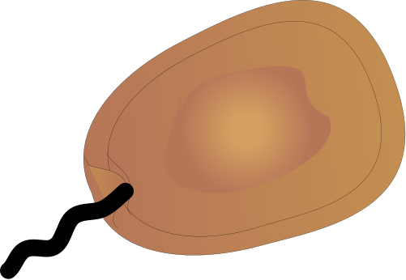

# Protist_Fungi_DB
## By: Samantha Gleich & Syrena Whitner
The Marine Microbial Eukaryote Transcriptome Sequencing Project (MMETSP) database is often used to annotate environmental sequence data; however, this databse does not contain references for a key group of marine protists, the MArine STramenopiles (MAST). Additionally, there is only one fungal group included in the MMETSP in its current form. Here, we show how to incorporate MAST SAGs and fungal reference genomes into a EUKulele database (https://eukulele.readthedocs.io/en/latest/). This database can then be used to annotate environmental sequence data. 
<br>
<br>
This repository will require the use of [TransDecoder](https://github.com/TransDecoder/TransDecoder) and [EUKulele](https://github.com/AlexanderLabWHOI/EUKulele).


## Download SAGs and fungal reference genomes.
SAG data were obtained from Labarre et al. (2021); https://doi.org/10.1038/s41396-020-00885-8
<br>
[Access the MAST SAG data here](https://figshare.com/articles/dataset/Co-assembly/12430790?backTo=/collections/Comparative_genomics_reveals_new_functional_insights_in_uncultured_MAST_species/5008046)
<br>
<br>
Fungal reference genomes can be obtained from the MycoCosm database. All 8 references listed under the "Marine Fungi" category were included. 
<br>
[Access the MycoCosm database here](https://mycocosm.jgi.doe.gov/mycocosm/home)

## Run TransDecoder on all assemblies to obtain protein sequences (.pep files).
```
./TransDecoder-TransDecoder-v5.7.1/TransDecoder.LongOrfs -t Assembly.fasta
```
## Add Source ID to all .pep file headers.
The SourceID needs to be in the header line (i.e., line containig '>') of each contig in each assembly. The SourceID you include here will need to match a taxonomy file that we will create next. 
```
sed 's/>.*/& \/SOURCE_ID=NameOfOrganism/‘ Assembly.pep > AssemblyNew.pep
```
## Concatenate all new (non-MMETSP) protein files together. Concatenate new protein files and the MMETSP protein file. 
Each .pep file here corresponds to a different reference transcriptome that is being added to the MMETSP.
```
cat AssemblyNew.pep AssemblyNew2.pep AssemblyNew3.pep > all_fungi_assemblies.pep
cat all_fungi_assemblies.pep mmetsp.pep > fungi_mmetsp.pep
```
## Make taxonomy table with taxonomy information for all of the new assemblies that are being added to the MMETSP. 
Make a taxonomy table that is in the same format as the EUKulele taxonomy table. Example: 
<br>
<br>
&emsp; Unnamed: 0 &emsp; Domain &emsp; Supergroup &emsp; Division &emsp; Class &emsp; Order &emsp; Family &emsp; Genus &emsp; Species &emsp; Source_ID
<br>
0 &emsp; 0 &emsp; Eukaryota &emsp; Opisthokonta &emsp; Ascomycota &emsp; Sordariomycetes &emsp; Microascales &emsp; Halosphaeriac &emsp; Corollospora &emsp; Corollospora_maritima &emsp; Corollospora
<br>
1 &emsp; 1 &emsp; Eukaryota &emsp; Opisthokonta &emsp; Basidiomycota &emsp; Agaricomycetes &emsp; Agaricales &emsp; Niaceae &emsp; Digitatispora &emsp; Digitatispora_marina &emsp; Digitatispora
<br>
<br>
The Source_ID columns must match the SOURCE_ID labels that were added to the .pep files above. Save this file as a .txt file (e.g., fungi_tax.txt) and remove the header row from the file for the next step. 

## Concatenate new taxonomy table with MMETSP taxonomy table.
```
cat mmetsp_tax.txt fungi_tax.txt > fungi_mmmetsp_tax.txt
```
## Run create_protein_table.py script in EUKulele to make a new database using the concatenated .pep file and the concatenated taxonomy (.txt) file.
```
create_protein_table.py --infile_peptide fungi_mmetsp.pep --infile_taxonomy fungi_mmetsp_tax.txt --outfile_json fungi_mmetsp_db.json --output fungi_mmetsp_db.txt --delim "/"
```
## Run EUKulele with custom (MMETSP + Fungi) database. The previous EUKulele command (create_protein_table.py) will produce 2 new database files (fungi_mmetsp_db.txt and fungi_mmetsp_db.json).
```
EUKulele -m mets --sample_dir /path/to/directory --out_dir /path/to/directory/eukulele_out --reference_dir /path/to/directory/ --ref_fasta fungi_mmetsp.pep --n_ext cds --tax_table fungi_mmetsp_db.txt --protein_map fungi_mmetsp_db.json
```
This EUKulele command will annotate your metatranscriptome assembly contigs using the custom fungi + mmetsp database!
